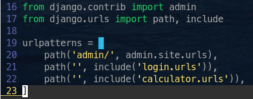

# Matrix Calculator

In this tutorial, you are going to learn how to use Django as a tool to build a web application following the MVT (Model View Template) pattern.


**Notes:**
- In this tutorial, we'll use Linux as our host OS, the major part of instructions works mostly in Linux.

- It is assumed that you have `python3` working in your Linux instalation by default.

## Django installation

First of all, you must download Django.

In arch-based distributions:

```bash
sudo pacman -S python-django
```

## Create your first project

To create a project you just need to run the following command in your terminal.

```bash
django-admin startproject <my_project_name>
```

This command will create the following files:


Here you have some util files such as `manage.py` `settings.py` and `urls.py`
these files will set some configurations about your app behavior.

**manage.py:** This is the most important file in your app, with this you will be able to create "apps", makemigrations and so much other things.

**settings.py:** This file makes your work easier, it sets useful variables to use with your apps. Later we'll see how to use it.

**urls.py:** It sets all the paths that your project use to redirect every user in the web page, in this case we will use it to centralize whole te url paths of our apps.

## Create your first app

To create an app you just need to run the following command in your terminal while you are into your principal project folder

```bash
./manage.py startapp <my_app_name>
```


Here you have some util files such as `models.py` and `views.py` both, the first and the second ones are doing a reference about Model and View parts of MVT.

**models.py:** Here you are going to add the DB models related to your app.

**views.py:** It does all the work related with the logical communication between the templates and models and vice versa.

All the other files are useful, but we won't go into them in detail.

## Configure your project environment

We want to centralize whole the project to do it easier to read and use, to do it, we need to do some configurations in the `settings.py` and the `` file.

### Centralize template and static folders

Here we are introducing the concept of the `template`, doing reference to the MVT pattern, the `template` works like the visible part of the app to the final user, it is, the GUI.

For this, you should create two directories under the directory called equal to your project root folder, `templates` and `static`.

```bash
# Under your project root folder
mkdir matrix_calculator/{templates, static}
```

We will be editing the `settings.py` file.

First your need to import _os_ from the python libraries.


After that, you are gonna edit an entry in the _DIRS_ list into the _TEMPLATES_ variable. It should look like this:


And after the change:

```python3
os.path.join(BASE_DIR, 'matrix_calculator', 'templates')
```


---

Now for the static directory we will do something similar, in the same file `settings.py` we are gonna add the following at the end of the file:

**Note:** It is possible that you have a variable called `STATIC_URL`, is necessary to erase it to avoid problems with the code below.

```python
# Static files (CSS, JavaScript, Images)
# https://docs.djangoproject.com/en/3.1/howto/static-files/

STATIC_URL = '/static/'

# Add these new lines
STATICFILES_DIRS = (
    os.path.join(BASE_DIR, 'matrix_calculator', 'static'),
)

STATIC_ROOT = os.path.join(BASE_DIR, 'staticfiles')
```

**NOTE:** The static directory and its files are a little section contained by the `template` concept.

### Add your apps to the installed apps

For Django is mandatory to control which apps to use, for this it sets the `INSTALLED_APPS` variable, you should add every app that you crate to get the best behavior of your project.

By default it should look like this:


And after the changes:

```python3
# Local apps
'login.apps.LoginConfig',
'calculator.apps.CalculatorConfig',

# Django apps
```

**Notes:**
- To understand in a better way these changes see Django documentation about the `apps.py` file.
- As you can see, here you have a `login` entry in the Local apps section, it's because later we will create this app, so, **don't worry** about a possible warning at the time of add it.


### Centralize the url paths

At this point, you must edit the `urls.py` file located in the same directory as the `settings.py` file

In this file, you will add as many entries as applications created in your project you have. It imports the whole entries located in an `urls.py` file stored in every app that you create. For our case we will have two apps, `login` and `calculator`, once again, **don't worry** about possible warnings before to create the correspondent apps and files. Too you need to import the `include` method from `django.urls`.

```python3
# Add include to this line
from django.urls import path, include

path('', include('login.urls')),
path('', include('calculator.urls')),
```

It should look as follows:



## Configure your apps

As we saw, we need to create the login app, so, as you did with the calculator app, in the project root folder:

```bash
./manage.py startapp login
```

At this point, your project should look like this:


After you need to create a file in every app, the `urls.py` one, for this:

```bash
touch {login,calculator}/urls.py
```

So, if you see your working tree:


In the urls.py file under `calculator` you should add something like this:

```python3
from django.urls import path

from . import views

urlpatterns = [
    path('dimensions/<n_rows>/<m_columns>/',
         views.enter_matrix_numbers, name='matrix_dimensions'),
    path('calculated/', views.calculate, name='calculated_matrix'),
]
```

And in the `login`'s one:

```python3
from django.urls import path
from calculator.views import get_matrix_dimensions

urlpatterns = [
    path('', get_matrix_dimensions, name='home')
]
```


As you can see, in these files, you added some entries referencing `views` and paths, this is because you are interacting with the `views.py` file into your apps and that will show the templates to the final users.

**Note:** To get more info about how the urls.py files work, see the Django documentation.

## Views and logic
